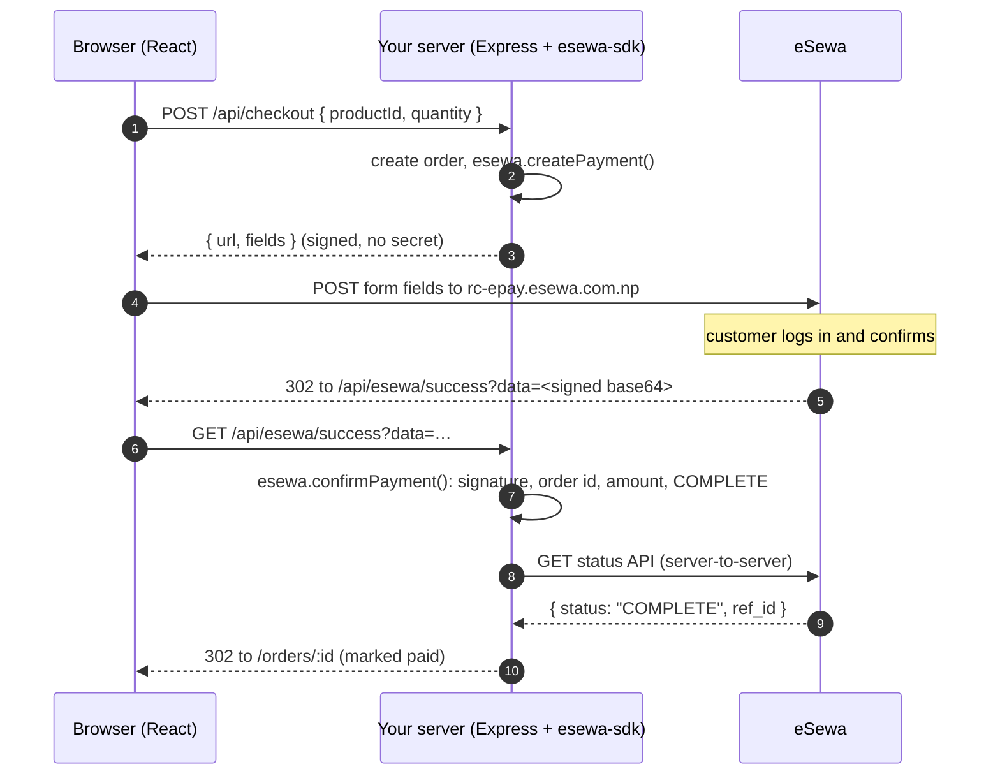

# Use case: eSewa checkout with Vite + React

A small tea shop that takes payment through **eSewa ePay v2**, built with [`esewa-sdk`](../../README.md).

- **Frontend:** Vite + React + TypeScript
- **Backend:** Express, which is the only part that touches the SDK and your secret key

The page has a side panel that shows what the SDK did: the signed fields sent to eSewa, and every check run on the way back. Use it to see the integration working, then copy the server code into your own app.

---

## Why there is a server

eSewa signs every payment with an HMAC secret key. Anything shipped to the browser is public, so **the secret key and the SDK must live on a server**.

| Lives in the browser (`src/`) | Lives on the server (`server/`) |
| --- | --- |
| Product list, cart, buttons | `ESEWA_SECRET_KEY` |
| Posting the already-signed form to eSewa | `esewa.createPayment()`: signs the request |
| Showing the order status | `esewa.confirmPayment()`: verifies eSewa's answer |
| | Order records and amounts |

The browser never computes or sends an amount the server trusts. The server recalculates the total from its own product list.

---

## Quick start

You need Node 20 or newer.

```bash
# 1. Build the SDK this example depends on (it lives two folders up)
cd use-cases/vite-react-checkout
npm run sdk:build

# 2. Create your own .env from the template
cp .env.example .env

# 3. Install and run
npm install
npm run dev
```

Open **http://localhost:5173**, pick a tea, and pay. On eSewa's test page, log in with:

| eSewa ID | Password | OTP |
| --- | --- | --- |
| `9806800001` (to `…05`) | `Nepal@123` | `123456` |

`.env` is optional for this quick start: every value in `.env.example` already defaults to eSewa's public test credentials (`EPAYTEST`) if `.env` is missing or a variable is unset, so test mode works with zero configuration. No real money moves in test mode. You only need to actually edit `.env` once you have your own merchant credentials — see [Configuration](#configuration) below for which variables become required then.

`npm run dev` starts two processes: Vite on port 5173 for the React app, and Express on port 3000 for the API. Vite forwards every `/api/*` request to Express, so the browser only ever talks to `localhost:5173`.

> Once `esewa-sdk` is published, replace `"esewa-sdk": "file:../.."` in `package.json` with a version (`"esewa-sdk": "^0.1.0"`) and skip step 1.

---

## How a payment flows



### 1. Start the payment: `POST /api/checkout`

The server creates an order and asks the SDK to sign it. The order id doubles as eSewa's `transaction_uuid`, which is how you find the order again when eSewa replies.

```ts
// server/index.ts
const payment = await esewa.createPayment({
  amount: order.amount,               // from your database, never from the request body
  taxAmount: order.taxAmount,
  deliveryCharge: order.deliveryCharge,
  transactionUuid: order.id,          // letters, digits and "-" only
  failureUrl: `${APP_URL}/api/esewa/failure/${order.id}`,
});

res.json({ order, esewa: { url: payment.url, fields: payment.fields } });
```

`payment.fields` is exactly the form eSewa expects. The SDK computes `total_amount`, generates the signature and fills in `signed_field_names`.

### 2. Send the customer to eSewa (browser)

ePay v2 is a plain HTML form POST. The browser builds a hidden form from the signed fields and submits it:

```ts
// src/api.ts
export function submitToEsewa(url: string, fields: Record<string, string>) {
  const form = document.createElement("form");
  form.method = "POST";
  form.action = url;
  for (const [name, value] of Object.entries(fields)) {
    const input = document.createElement("input");
    input.type = "hidden";
    input.name = name;
    input.value = value;
    form.append(input);
  }
  document.body.append(form);
  form.submit();
}
```

The checkbox "Show the signed request before going to eSewa" pauses here so you can inspect the fields. Turn it off for the real flow.

### 3. Verify the payment: `GET /api/esewa/success`

eSewa redirects the customer back with `?data=<base64 JSON>`. **Never mark an order paid just because this URL was hit.** Anyone can type it into a browser. `confirmPayment()` does the checks:

```ts
// server/index.ts
const callbackUrl = new URL(req.originalUrl, APP_URL);

// Which order is this? (signature is checked here too)
const { transactionUuid } = await esewa.verifyCallback(callbackUrl);
const order = getOrder(transactionUuid);

// Everything that must be true before you ship anything:
const { callback, status } = await esewa.confirmPayment(callbackUrl, {
  expectedAmount: order.totalAmount,     // paid amount must equal the order total
  expectedTransactionUuid: order.id,     // callback must belong to this order
});

markPaid(order, status?.refId ?? callback.transactionCode);
```

`confirmPayment()` throws an `EsewaError` unless:

1. the HMAC signature is valid (the data really came from eSewa),
2. `product_code` is yours,
3. `transaction_uuid` and the amount match the order,
4. the status is `COMPLETE`,
5. eSewa's status API, called server-to-server, also says `COMPLETE`.

If any check fails, the order stays **pending** and the error is logged. It isn't marked failed, because a network blip on step 5 doesn't mean the customer didn't pay.

### 4. Handle cancellations: `GET /api/esewa/failure/:orderId`

eSewa sends the customer here if they cancel, the session expires, or the payment is still pending. This route only logs a note. The definitive answer comes from the status check.

### 5. Settle anything unclear: `POST /api/orders/:id/check-status`

If the customer closed the tab after paying, the success redirect never reaches you. Ask eSewa directly:

```ts
const result = await esewa.checkStatus({ transactionUuid: order.id, totalAmount: order.totalAmount });
// result.status: COMPLETE | PENDING | AMBIGUOUS | NOT_FOUND | CANCELED | FULL_REFUND | PARTIAL_REFUND
```

The order page has an **Ask eSewa for the status** button that calls this. In production, also run it from a scheduled job for every order that has been pending for more than about five minutes, as eSewa recommends.

| eSewa status | What this example does |
| --- | --- |
| `COMPLETE` | mark paid |
| `NOT_FOUND`, `CANCELED` | mark failed |
| `FULL_REFUND`, `PARTIAL_REFUND` | mark refunded |
| `PENDING`, `AMBIGUOUS` | leave pending, check again later |

---

## Optional: Token payment

`/api/esewa-token/*` shows the SDK's other mode. The customer types an order id into the eSewa app, and **eSewa calls your server**. You only need it if eSewa enables Token payment for your merchant account.

Try it with curl while the dev server runs. Take an order id from the shop's "Ready to send" panel:

```bash
ORDER=ILAM-261003-XXXXXXXX

# eSewa asks: what is this token, and how much is owed?
curl -u esewa:change-me http://localhost:3000/api/esewa-token/inquiry/$ORDER

# eSewa says: the customer paid ("amount" must equal the order total from the inquiry)
curl -u esewa:change-me -X POST http://localhost:3000/api/esewa-token/payment \
  -H 'content-type: application/json' \
  -d "{\"request_id\":\"$ORDER\",\"amount\":1060.5,\"transaction_code\":\"TK123\"}"

# eSewa asks: did you record it?
curl -u esewa:change-me -X POST http://localhost:3000/api/esewa-token/status \
  -H 'content-type: application/json' \
  -d "{\"request_id\":\"$ORDER\",\"amount\":1060.5,\"transaction_code\":\"TK123\"}"
```

The username and password come from `ESEWA_TOKEN_API_USER` and `ESEWA_TOKEN_API_PASSWORD`. Agree on them with eSewa.

---

## Configuration

```bash
cp .env.example .env
```

Then edit `.env`. Everything is **optional in test mode** — the server falls back to eSewa's public test credentials if a variable is missing. The variables marked below become **required** once you set `ESEWA_ENV=production`.

| Variable | Default | Required in production? | Purpose |
| --- | --- | --- | --- |
| `ESEWA_ENV` | `test` | yes (set to `production`) | `test` uses eSewa's UAT servers; `production` is live money |
| `ESEWA_PRODUCT_CODE` | `EPAYTEST` | **yes** | merchant code issued by eSewa |
| `ESEWA_SECRET_KEY` | test key | **yes** | HMAC secret issued by eSewa; keep it out of the repo |
| `APP_URL` | `http://localhost:5173` | **yes** | public HTTPS URL of the app; eSewa redirects customers here |
| `PORT` | `3000` | no | Express port |
| `ESEWA_TOKEN_API_USER` / `_PASSWORD` | `esewa` / `change-me` | only if you use Token payment | Basic auth for the Token payment API |
| `ESEWA_STATUS_URL` | eSewa's | no | point the status check at a mock server for offline testing |

Without real values for the **yes** rows, signatures won't match eSewa's live servers and payments will be rejected — see [Troubleshooting](#troubleshooting).

---

## Going to production

```bash
npm run build                                   # builds the React app into dist/
ESEWA_ENV=production \
ESEWA_PRODUCT_CODE=YOUR_CODE \
ESEWA_SECRET_KEY='your-live-key' \
APP_URL=https://shop.example.com \
npm start                                       # Express serves dist/ and /api on one port
```

Before taking real payments:

- [ ] Replace `server/orders.ts` (in-memory, lost on restart) with your database.
- [ ] Keep `markPaid` idempotent. eSewa's redirect can arrive more than once, and a refresh replays it.
- [ ] Set `APP_URL` to your real HTTPS domain; eSewa sends customers there.
- [ ] Load `ESEWA_SECRET_KEY` from a secret manager, never from the repo.
- [ ] Schedule `checkStatus` for orders pending more than about five minutes.
- [ ] Change the Token API password, or delete that section if you don't use Token payment.
- [ ] Remove the "Show the signed request" toggle and the trace panel, or hide them behind a debug flag.

---

## Project layout

```
vite-react-checkout/
├── server/
│   ├── index.ts      All routes: checkout, success, failure, status, Token API
│   ├── esewa.ts      The one place the SDK is configured (secret key lives here)
│   ├── orders.ts     In-memory order store: swap for your database
│   └── env.ts        Loads .env before anything reads it
├── shared/
│   └── types.ts      Product catalog and Order type used by both sides
├── src/
│   ├── api.ts        Calls the server; submits the signed form to eSewa
│   ├── App.tsx       Two routes: / and /orders/:id
│   ├── pages/
│   │   ├── ShopPage.tsx
│   │   └── OrderPage.tsx
│   ├── components/Trace.tsx   The "what the SDK did" panel
│   └── styles.css
├── vite.config.ts    Proxies /api to Express in development
└── .env.example
```

---

## Troubleshooting

**"Cannot find module 'esewa-sdk'"**
The SDK hasn't been built. Run `npm run sdk:build`.

**eSewa shows an error page right after "Continue to eSewa"**
The signature didn't match. Check that `ESEWA_PRODUCT_CODE` and `ESEWA_SECRET_KEY` belong together, and that `ESEWA_ENV` matches them. Test keys only work with `test`.

**Back on the shop with "eSewa's response could not be verified"**
The `data` parameter failed its signature check. This usually means the server is using a different secret key from the one that signed the payment.

**Order stays "Waiting for confirmation" after paying**
The order page's trace panel shows why. `NETWORK_ERROR` means your server couldn't reach eSewa's status API; press **Ask eSewa for the status** to retry.

**"Order not found" after restarting the server**
Orders are kept in memory in this example. Use a database in your app.

**"Login Error: Service is currently unavailable. Please try again later."**
This appears on eSewa's own login page, after your signed form has already been submitted — it isn't something this app or the SDK can catch or retry. Before assuming it's eSewa's flaky shared UAT environment (common — every developer testing eSewa integrations shares the same few `EPAYTEST` test accounts), rule out a config mistake by checking the box **"Show the signed request before going to eSewa"** on the shop page. A correct request looks like this:

```json
{
  "url": "https://rc-epay.esewa.com.np/api/epay/main/v2/form",
  "fields": {
    "amount": "850",
    "tax_amount": "110.5",
    "total_amount": "1060.5",
    "transaction_uuid": "ILAM-261004-0F47D3AD",
    "product_code": "EPAYTEST",
    "product_service_charge": "0",
    "product_delivery_charge": "100",
    "success_url": "http://localhost:5173/api/esewa/success",
    "failure_url": "http://localhost:5173/api/esewa/failure/ILAM-261004-0F47D3AD",
    "signed_field_names": "total_amount,transaction_uuid,product_code",
    "signature": "p+xDmh38zOvVXsf7WMQbMFDBgHxy07+tMTsxO6dPmvQ="
  }
}
```

Check your own panel against it:

- `product_code` must be `EPAYTEST` in test mode — not blank, not a real merchant code
- `total_amount` = `amount` + `tax_amount` + `product_delivery_charge`
- `signed_field_names` should be exactly `total_amount,transaction_uuid,product_code`
- `success_url` / `failure_url` should point at your actual `APP_URL`, not something stale

If all of that checks out, the request is correct and the error is on eSewa's side — retry in a few minutes, or try a different test ID from the table above (`9806800001` through `…05`).
